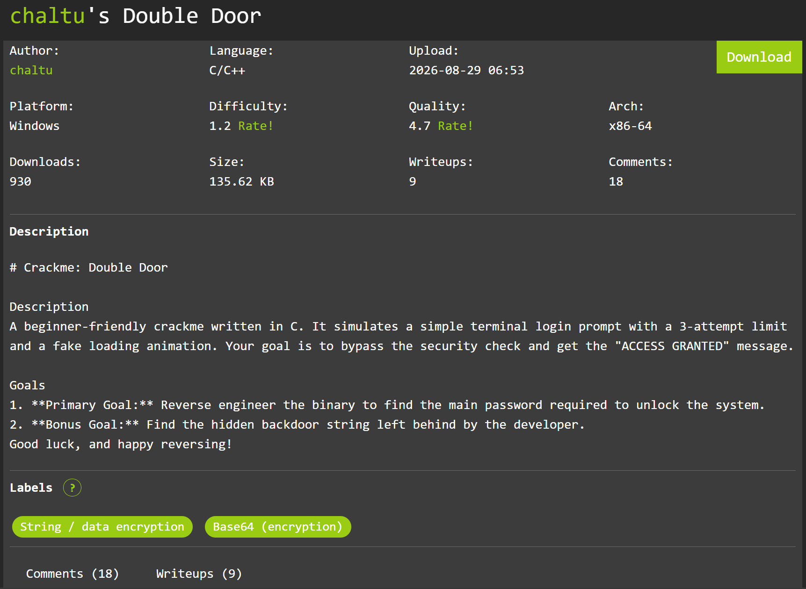
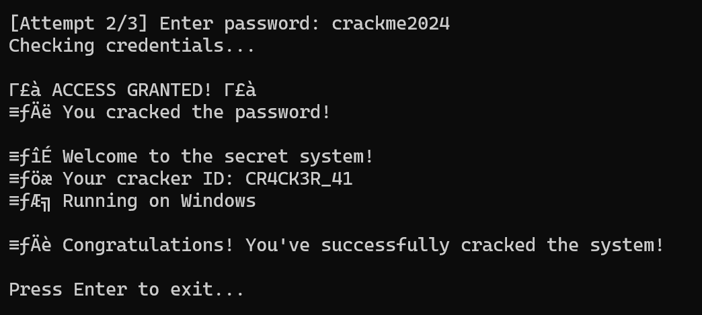
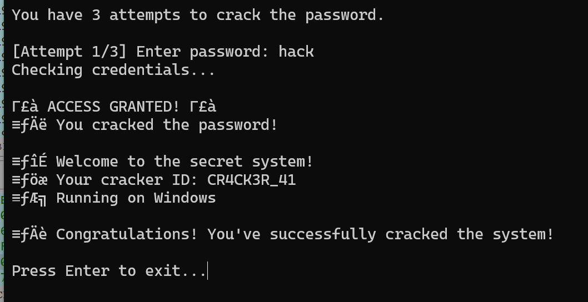

# Double Door
## Summary


A beginner-friendly crackme written in C. It simulates a simple terminal login prompt with a 3-attempt limit and a fake loading animation. Your goal is to bypass the security check and get the "ACCESS GRANTED" message.

## Solution
Just a easy check password in the file `.exe`

Let review the main function:
```c
int __fastcall main(int argc, const char **argv, const char **envp)
{
  FILE *v3; // rax
  int v4; // eax
  char Buffer[64]; // [rsp+20h] [rbp-50h] BYREF
  size_t v7; // [rsp+60h] [rbp-10h]
  int v8; // [rsp+68h] [rbp-8h]
  int v9; // [rsp+6Ch] [rbp-4h]

  _main();
  v9 = 0;
  v8 = 0;
  system_0("cls");
  display_banner();
  printf("You have %d attempts to crack the password.\n\n", 3);
  while ( v9 <= 2 && !v8 )
  {
    printf("[Attempt %d/%d] Enter password: ", v9 + 1, 3);
    v3 = __acrt_iob_func(0);
    if ( fgets_0(Buffer, 50, v3) )
    {
      v7 = strlen(Buffer);
      if ( v7 )
      {
        if ( Buffer[v7 - 1] == 10 )
          Buffer[v7 - 1] = 0;
      }
    }
    loading_animation();
    if ( check_password(Buffer) )
    {
      puts_0(asc_7FF6778D4221);
      puts_0(&byte_7FF6778D4240);
      puts_0(asc_7FF6778D4260);
      v4 = rand();
      printf(&byte_7FF6778D4288, (unsigned int)(v4 % 10000));
      puts_0(&byte_7FF6778D42AA);
      v8 = 1;
    }
    else
    {
      puts_0(asc_7FF6778D42C2);
      puts_0("Wrong password. Try again.\n");
      ++v9;
    }
  }
  if ( v8 )
  {
    puts_0(asc_7FF6778D43A8);
  }
  else
  {
    puts_0(asc_7FF6778D42F6);
    puts_0("Too many failed attempts. System locked!");
    puts_0("Please contact system administrator.");
    puts_0(asc_7FF6778D4370);
    puts_0(&byte_7FF6778D4392);
  }
  printf("\nPress Enter to exit...");
  getchar_0();
  return 0;
}
```

As you you can see here have the function `check_password`

```c
loading_animation();
    if ( check_password(Buffer) )
    {
      puts_0(asc_7FF6778D4221);
      puts_0(&byte_7FF6778D4240);
      puts_0(asc_7FF6778D4260);
      v4 = rand();
      printf(&byte_7FF6778D4288, (unsigned int)(v4 % 10000));
      puts_0(&byte_7FF6778D42AA);
      v8 = 1;
    }
```
Let get divide into the `check_password` function:
```c
_BOOL8 __fastcall check_password(const char *a1)
{
  char v2[4]; // [rsp+2Ch] [rbp-44h] BYREF
  char Str2[56]; // [rsp+30h] [rbp-40h] BYREF
  const char *v4; // [rsp+68h] [rbp-8h]

  v4 = "Y3JhY2ttZTIwMjQ=";
  base64_decode("Y3JhY2ttZTIwMjQ=", Str2, v2);
  return !strcmp(a1, Str2) || strstr(a1, "hack") != nullptr;
}
```

You can see here we have 2 passwords, the base64 password and `hack` password.

Decode the base64 password and we have `crackme2024`



Other password can get access



## Flag
```
CR4CK3R_41
```

