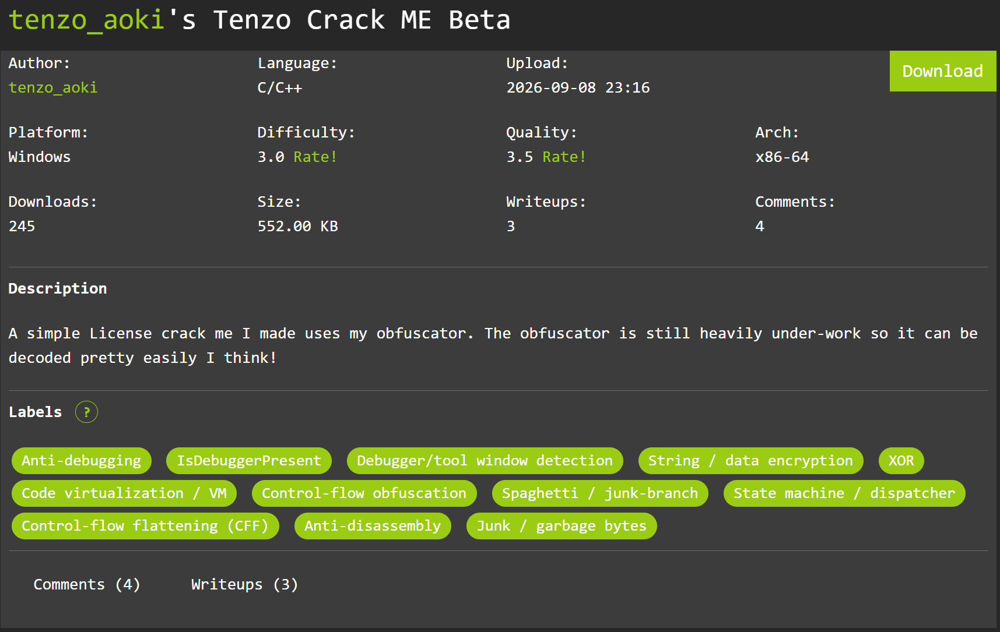

# Tenzo Crack ME Beta

## Summary


- File: `Crackme_Tenzo.exe`, `sub_140001000` (đến `0x14000841E`) là hàm validate — chỉ gọi mỗi `QueryPerformanceCounter` (import duy nhất), phần còn lại là MBA/state-machine.
- Đối số là `std::string` MSVC; ký tự được đọc lần lượt tại `movzx eax, byte [rax+r14]` ở `0x140005C6C`.
- Ký tự sai đầu tiên → return ngay (bail), ký tự đúng → đọc ký tự tiếp theo. Đây chính là oracle.

Về phần loại obfuscated thì file này bị obfuscated nặng về 2 loại là: `Control-flow flattening (CFF)` và `MBA`

Bạn có thể tìm hiểu các loại này ở đây: 

- https://github.com/obfuscator-llvm/obfuscator/wiki/Control-Flow-Flattening
- https://ir2re.fyi/posts/breaking-down-mba-obfuscation/ 

Mình tìm đc bạn nó về cái MBA obfuscation khá hay

## Solution 

### Dựng Unicorn harness

Map toàn bộ PE tại `0x140000000`, fake TEB/PEB (chống probe `gs:[0x60]`, `BeingDebugged=0`), hook `QueryPerformanceCounter` trả hằng số, RSP = stack sạch + sentinel return.

**Điểm sống còn của challenge:** `std::string` phải ở **dạng heap** (`_Myres = 0x2F = 47`, buffer riêng), không phải SSO (`_Myres = 15`). Validator có check `cmp [r15+18h], 10h` — nếu để SSO thì dù byte đúng ở vị trí 16 cũng không bao giờ xem là "match", làm cả 2 oracle (advance + return) đều mù ở vị trí 16. Đây chính là vì sao phần brute-force ban đầu bế tắc và chỉ giải quyết được sau khi chuẩn layout string.

### Oracle brute-force

- Với mỗi vị trí: thử từng ký tự in được; ký tự nào làm `r14 > pos` (tức program đọc tiếp ký tự `pos+1`) là đúng.
- Ký tự cuối (vị trí 31) không có bước đọc tiếp theo nên dùng oracle return: candidate đúng cho `retval == 1` (`(RAX & 1)`).

```python
import struct
import pefile
from unicorn import *

BINARY = r"C:\Users\Lecoo\Downloads\6aa09754dbb3353b753967e4\Crackme_Tenzo.exe"

IMAGE_BASE = 0x140000000
IMAGE_SIZE = 0x91000
FUNC_START = 0x140001000
CHAR_READ  = 0x140005C6C      # movzx eax, byte [rax+r14]
QPC_IAT    = 0x140075000
QPC_STUB   = 0x140090400
STACK_BASE, STACK_SIZE = 0x20000000, 0x200000
STRING_STRUCT, STRING_ADDR = 0x0FFFF000, 0x10000000
TEB_ADDR, PEB_ADDR = 0x40000000, 0x40001000
SENTINEL    = 0x61800000
DLL_QUANTUM = 0x12345678
ALPHABET    = bytes(range(0x20, 0x7F))

def build_emulator(candidate: bytes):
    mu = Uc(UC_ARCH_X86, UC_MODE_64)
    pe = pefile.PE(BINARY)
    mu.mem_map(IMAGE_BASE, IMAGE_SIZE, UC_PROT_ALL)
    for s in pe.sections:
        raw = s.get_data()
        mu.mem_write(IMAGE_BASE + s.VirtualAddress, raw[:s.Misc_VirtualSize])
    mu.mem_map(STACK_BASE, STACK_SIZE, UC_PROT_ALL)
    stack_top = STACK_BASE + STACK_SIZE - 0x100
    mu.mem_write(stack_top, struct.pack("<Q", SENTINEL))
    mu.mem_map(TEB_ADDR, 0x2000, UC_PROT_ALL)
    mu.mem_write(TEB_ADDR + 0x30, struct.pack("<Q", TEB_ADDR))
    mu.mem_write(TEB_ADDR + 0x60, struct.pack("<Q", PEB_ADDR))
    peb = bytearray(0x1000); peb[0x02] = 0
    struct.pack_into("<Q", peb, 0x10, IMAGE_BASE)
    mu.mem_write(PEB_ADDR, bytes(peb))
    mu.reg_write(UC_X86_REG_GS_BASE, TEB_ADDR)
    stub = b"\x48\xC7\x01" + struct.pack("<I", DLL_QUANTUM) + b"\xB8\x01\x00\x00\x00\xC3"
    mu.mem_write(QPC_STUB, stub)
    mu.mem_write(QPC_IAT, struct.pack("<Q", QPC_STUB))
    # std::string dang heap (QUAN TRONG: _Myres >= 16)
    mu.mem_map(STRING_STRUCT, 0x1000, UC_PROT_ALL)
    mu.mem_map(STRING_ADDR, 0x1000, UC_PROT_ALL)
    mu.mem_write(STRING_ADDR, candidate + b"\x00")
    obj = bytearray(0x40)
    struct.pack_into("<Q", obj, 0x00, STRING_ADDR)
    struct.pack_into("<Q", obj, 0x10, len(candidate))   # _Mysize
    struct.pack_into("<Q", obj, 0x18, 47)               # _Myres = 47
    mu.mem_write(STRING_STRUCT, bytes(obj))
    mu.reg_write(UC_X86_REG_RCX, STRING_STRUCT)
    mu.reg_write(UC_X86_REG_RSP, stack_top)
    return mu

def run_candidate(candidate: bytes, advance_threshold):
    state = {"max": -1, "hit": False, "retval": 0}
    def on_code(mu, address, size, ud):
        if address == CHAR_READ:
            r14 = mu.reg_read(UC_X86_REG_R14)
            state["max"] = max(state["max"], int(r14))
            if advance_threshold is not None and state["max"] >= advance_threshold:
                mu.emu_stop()
        elif address == SENTINEL:
            state["hit"] = True
            state["retval"] = mu.reg_read(UC_X86_REG_RAX) & 1
            mu.emu_stop()
    mu = build_emulator(candidate)
    mu.hook_add(UC_HOOK_CODE, on_code)
    try:
        mu.emu_start(FUNC_START, SENTINEL, timeout=500_000_000, count=0)
    except UcError:
        pass
    return state["max"], state["retval"], state["hit"]

def solve():
    key = b""
    for pos in range(32):
        found = None
        for c in ALPHABET:
            cand = key + bytes([c]) + b"X" * (31 - len(key))
            maxidx, _, _ = run_candidate(cand, advance_threshold=pos + 1)
            if maxidx >= pos + 1:
                found = c
                break
        if found is None:                      # ky tu cuoi cung: oracle return
            for c in ALPHABET:
                cand = key + bytes([c])
                _, retval, hit = run_candidate(cand, advance_threshold=None)
                if hit and retval == 1:
                    found = c
                    break
        if found is None:
            raise SystemExit(f"FAIL tai vi tri {pos}: {key!r}")
        key += bytes([found])
        print(f"[{pos}] = {chr(found)!r} -> {key!r}", flush=True)
    return key

key = solve()
print("\nKEY:", key.decode())
open(r"C:\Users\Lecoo\AppData\Local\Temp\opencode\tenzo_key.txt", "wb").write(key)
```

Kết quả từng bước: vị trí 0→15 cho `T3nz0-VM-2026-V1`, vị trí 16→31 tiếp tục bằng oracle advance, vị trí 31 bằng oracle return.

### Xác minh

Cùng emulator, chạy lại key đầy đủ: `max_idx = 31`, `(RAX & 1) = 1` — và được xác nhận là gõ thành công vào binary thật.

## Flag

```
T3nz0-VM-2026-V1rtu4l-Unl0ck3d!!
```

`T3nz0-VM-2026-V1` + `rtu4l-Unl0ck3d!!` ("ritual-Unlock3d" leet) — key 32 ký tự.

**Bài này là e tham khảo writeup để làm**