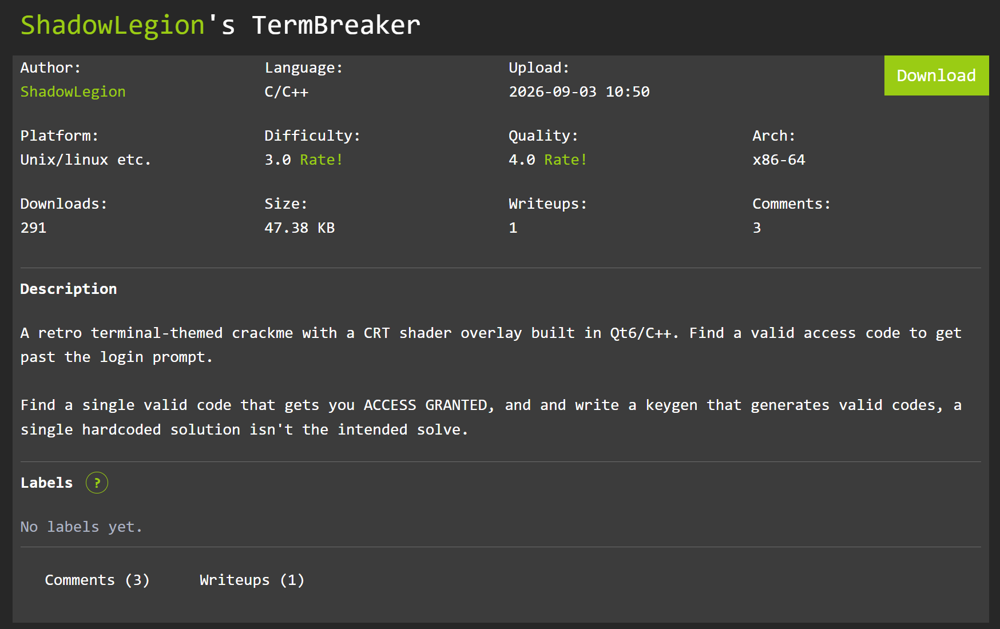

# TermBreaker

## Summary


A retro terminal-themed crackme with a CRT shader overlay built in Qt6/C++. Find a valid access code to get past the login prompt.

Find a single valid code that gets you ACCESS GRANTED, and and write a keygen that generates valid codes, a single hardcoded solution isn't the intended solve.
## Solution
### Xác định hàm validation
Mở binary bằng IDA. Các string quan trọng nằm ở `.rodata`:

- `0x8210` — `"AUTHENTICATING...\nACCESS GRANTED - WELCOME, OPERATOR"`
- `0x8248` — `"ACCESS GRANTED!\nCongratulations, you cracked it!"`
- `0x8280` — `"AUTHENTICATION FAILED - CODE REJECTED"`

Dùng cross-reference tới `0x8280` tìm được hàm xử lý: `sub_64E0` (constructor `MainWindow`) kết nối signal `QLineEdit::returnPressed`, `qt_metacall` (`sub_5E10`) dispatch tới slot `OnSubmitClicked` = **`sub_60B0`**.

Giải mã hóa `sub_60B0`:

1. **Độ dài**: `QString` size tại `[rsp+0x30]`, `cmp ..., 8` → bắt buộc đúng 8. (`setMaxLength(8)` gọi ở `0x68A2`).
2. **Bảng ký tự**: mỗi char được đọc là WORD (UTF-16), kiểm tra `char-0x41 <= 0x19` (A–Z) hoặc `char-0x30 <= 9` (0–9). Nếu vi phạm → nhảy tới nhánh FAIL (`0x612F`, đổi màu đỏ `#FF4500` + set text "CODE REJECTED").
3. **Phép tính tổng có trọng số** (`0x62B9`–`0x62F0`):

```
edx = 3*c2 + 2*c1 + c0
esi = edx + 4*c3
edx = 5*c4 + esi
edx = edx + 6*c5
edx = edx + 7*c6
ebp = edx + 8*c7
cmp ebp, 0xB28            ; 0xB28 = 2856
jne FAIL                  ; 0x64A1
```

Tức là `Σ (i+1) * ascii(code[i]) == 2856`, với giá trị ASCII **thô** của ký tự (không phải giá trị nibble hex). Có một bản sao của phép check này ở hàm `sub_5F90` (dead code, cùng công thức, cùng hằng số `0xB28`).

Đúng tổng → set text xanh `#FFE066` "AUTHENTICATING...\nACCESS GRANTED - WELCOME, OPERATOR" và popup `QMessageBox` "ACCESS GRANTED! / Congratulations, you cracked it!".

### Keygen

Tổng là số trong khoảng `48*36 = 1728` → `90*36 = 3240`, nên luôn solvable bằng cách chọn 7 ký tự ngẫu nhiên và giải các ký tự cuối: `x = (2856 - S) / 8`, yêu cầu `x` nguyên và thuộc `[0-9A-Z]`.

```python
import random

TARGET = 0xB28
ALPHA = [c for c in range(48,58)] + [c for c in range(65,91)]  # 0-9, A-Z

def check(code):
    b = code.encode("ascii")
    return (len(b) == 8
            and all(48 <= x <= 57 or 65 <= x <= 90 for x in b)
            and sum((i+1)*b[i] for i in range(8)) == TARGET)

def keygen():
    while True:
        first7 = [random.choice(ALPHA) for _ in range(7)]
        s = sum((i+1)*first7[i] for i in range(7))
        x = TARGET - s
        if x % 8:
            continue
        x //= 8
        if 48 <= x <= 57 or 65 <= x <= 90:
            return "".join(chr(c) for c in first7 + [x])

if __name__ == "__main__":
    for c in [keygen() for _ in range(5)]:
        assert check(c), c
        print(c, "PASS")
```

```
NQY1FXUU PASS
UIYNULCW PASS
8YVHQPIU PASS
UOKUUGSM PASS
97FVOAZZ PASS
```

### Xác minh

Thủ công với mã `NQY1FXUU`:
`78 + 2·81 + 3·89 + 4·49 + 5·70 + 6·88 + 7·85 + 8·85 = 78+162+267+196+350+528+595+680 = 2856` ✓ — 8 ký tự, toàn `0-9A-Z`.

