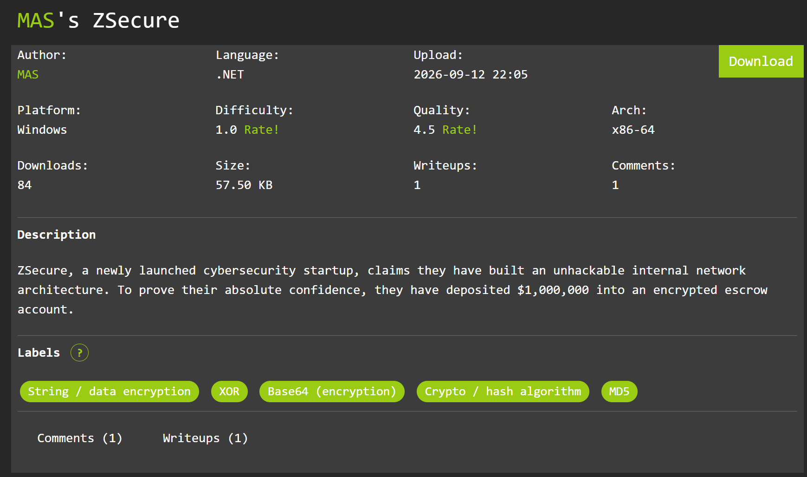
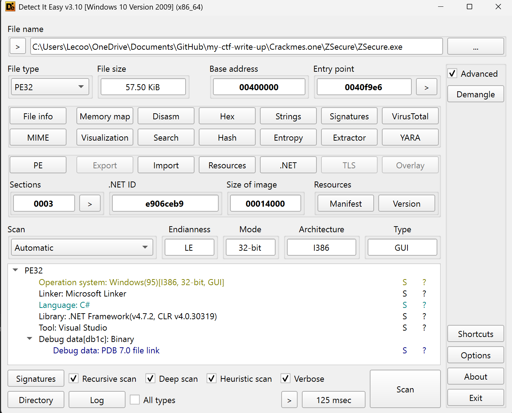
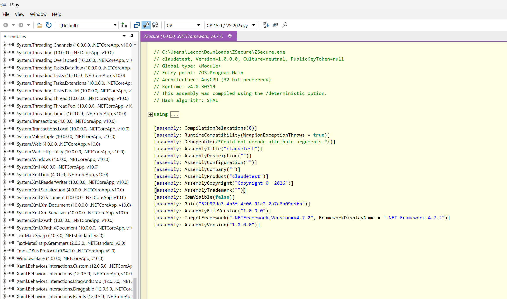

# Zsecure
## Summary

## Solution 
First let examine a file 

You can see here, it was written by `C#` and library: `.NET`

We need to use i tool call `ILSpy` to solve this library 

You can download this tool here: https://github.com/icsharpcode/ILSpy/releases

Now let open this `.exe` file in `ILSpy`



Here is the view of the file


We need to find the logical of this file, so i find in the namespace `ZOS` , class `GameState`

Get to the string `Decodeflag()` to view it

Here is the code `Decodeflag()`
```c#
private static string DecodeFlag()
	{
		byte[] array = new byte[23]
		{
			253, 56, 39, 224, 90, 244, 76, 22, 132, 27,
			211, 76, 15, 152, 67, 210, 127, 61, 165, 71,
			200, 125, 33
		};
		byte[] array2 = new byte[5] { 167, 19, 92, 209, 46 };
		for (int i = 0; i < array.Length; i++)
		{
			array[i] ^= array2[i % array2.Length];
		}
		return Encoding.ASCII.GetString(array);
	}
```

Just copy 2 array bytes in this code then decode with `python` like this:

```python
blob = bytes([0xFD,0x38,0x27,0xE0,0x5A,0xF4,0x4C,0x16,0x84,0x1B,0xD3,0x4C,0x0F,0x98,0x43,0xD2,0x7F,0x3D,0xA5,0x47,0xC8,0x7D,0x21])
key  = bytes([0xA7,0x13,0x5C,0xD1,0x2E])
flag = bytes(b ^ key[i % len(key)] for i, b in enumerate(blob))
print(flag.decode())
```

## Flag
```
Z+{1tS_JU5t_SImulation}
```

