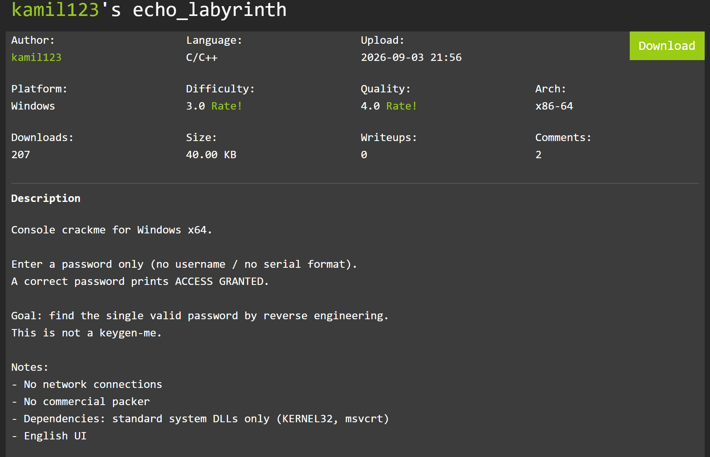
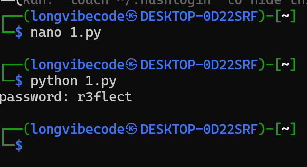
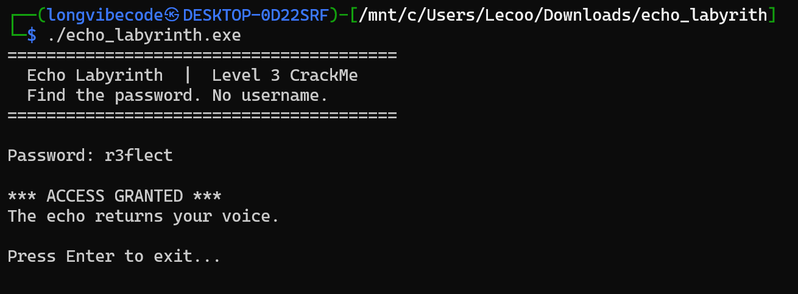

# Echo Labyrinth 
## Summary



## Solution
CrackMe Windows x64 (MinGW-w64), yêu cầu tìm password 7 ký tự. Toàn bộ logic kiểm tra nằm trong một hàm, gồm 4 phép biến đổi/kiểm tra độc lập trên input. Dùng static analysis trong IDA + mô hình hóa toàn bộ ràng buộc bằng Z3
### Tìm main trong IDA

Tìm string `"Password: "` (0x1400090FC) → xref tới `sub_140007BC0`, đây là main logic. 

Hàm main:
```c
__int64 sub_140007BC0()
{
  char *v0; // rbx
  FILE *v1; // rax
  char *v2; // rdx
  __int64 result; // rax
  char v4; // r8
  __int64 v5; // rdx
  char v6; // al
  unsigned __int8 *v7; // rdx
  unsigned __int8 v8; // r8
  int v9; // r9d
  __int16 v10; // ax
  char *v11; // rax
  int v12; // r10d
  int v13; // ecx
  int v14; // edx
  int v15; // eax
  int v16; // eax
  int v17; // eax
  __int64 v18; // [rsp+28h] [rbp-70h] BYREF
  int v19; // [rsp+30h] [rbp-68h]
  __int16 v20; // [rsp+34h] [rbp-64h]
  char v21; // [rsp+36h] [rbp-62h]
  char Buffer[16]; // [rsp+50h] [rbp-48h] BYREF
  __int128 v23; // [rsp+60h] [rbp-38h]
  __int128 v24; // [rsp+70h] [rbp-28h]
  __int128 v25; // [rsp+80h] [rbp-18h]

  sub_1400015D0();
  SetConsoleTitleA("Echo Labyrinth — Level 3 CrackMe");
  sub_140007B70("========================================\n");
  sub_140007B70("  Echo Labyrinth  |  Level 3 CrackMe\n");
  sub_140007B70("  Find the password. No username.\n");
  sub_140007B70("========================================\n\n");
  sub_140001480();
  if ( dword_140008000 != -1073623027 )
    sub_140007B70("[!] Unusual environment detected.\n\n");
  v0 = Buffer;
  *(_OWORD *)Buffer = 0;
  v23 = 0;
  v24 = 0;
  v25 = 0;
  sub_140007B70("Password: ");
  v1 = (FILE *)off_1400080C0();
  v2 = fgets(Buffer, 64, v1);
  result = 1;
  if ( v2 )
  {
    Buffer[strcspn(Buffer, "\r\n")] = 0;
    sub_140001480();
    sub_140001480();
    if ( strlen(Buffer) == 7 )
    {
      v4 = 0;
      v18 = 0;
      v5 = 0;
      v19 = -1321183386;
      v20 = -27742;
      v21 = -4;
      do
      {
        v6 = *((_BYTE *)&v19 + v5) ^ __ROL1__(v4 + Buffer[v5], 3);
        if ( dword_140008000 != -1073623027 )
          v6 ^= dword_140008000;
        *((_BYTE *)&v18 + v5++) = v6;
        v4 += 7;
      }
      while ( v5 != 7 );
      v7 = (unsigned __int8 *)&v18;
      v8 = 0;
      LOWORD(v9) = 0;
      while ( 1 )
      {
        v10 = *v7;
        v8 ^= v10;
        v9 = (unsigned __int16)(v9 + v10);
        v19 = (unsigned __int8)v10 | 1;
        if ( (((_BYTE)v19 * ((unsigned __int8)v10 | 1)) & 1) == 0 )
          break;
        if ( (unsigned __int8 *)((char *)&v18 + 7) == ++v7 )
        {
          v11 = Buffer;
          v12 = 5381;
          do
            v12 = (33 * v12) ^ (unsigned __int8)*v11++;
          while ( &Buffer[7] != v11 );
          if ( dword_140008000 != -1073623027 )
            v12 ^= dword_140008000;
          v13 = 0;
          v14 = -91;
          do
          {
            ++v0;
            v15 = 65 * v14;
            LOBYTE(v14) = (unsigned __int8)v14 >> 3;
            v16 = v13 + v15;
            v13 += 3;
            LOBYTE(v16) = *(v0 - 1) + v16;
            v14 ^= v16;
          }
          while ( (_BYTE)v13 != 21 );
          v17 = 16 * (v9 == 1144);
          if ( v8 == 44 )
            v17 += 32;
          if ( v12 == -1670968740 )
            v17 += 64;
          if ( (_BYTE)v14 == 115 )
            v17 += 128;
          if ( dword_140008000 == -1073623027
            && ((unsigned __int16)v12 ^ (v9 | (v8 << 16)) ^ (16777619 * (unsigned __int8)v14)) == 0x732CBB2D
            && v17 == 240 )
          {
            sub_140007B70("\n*** ACCESS GRANTED ***\n");
            sub_140007B70("The echo returns your voice.\n");
            goto LABEL_6;
          }
          break;
        }
      }
    }
    sub_140007B70("\n*** ACCESS DENIED ***\n");
    sub_140007B70("Only silence in the labyrinth.\n");
LABEL_6:
    *(_OWORD *)Buffer = 0;
    v23 = 0;
    v24 = 0;
    v25 = 0;
    sub_140007B70("\nPress Enter to exit...");
    getchar();
    return 0;
  }
  return result;
}
```
Hàm nhận input qua `fgets(Buffer, 64, stdin)`, cắt dấu xuống dòng, rồi yêu cầu `strlen == 7`.

Trước khi kiểm tra, chương trình chạy anti-debug `sub_140001480`: ghi `dword_140008000` = `0xC001D00D` (môi trường sạch) hoặc XOR với hằng số khi phát hiện debugger. Toàn bộ các nhánh `cmp dword_140008000, 0C001D00Dh` đều bỏ qua bước XOR khi chạy bình thường.

Giả mã từ IDA (đã rút gọn):

```c
// key bytes: v19=0xB1405766, v20=0x93A2, v21=0xFC
unsigned char key[7] = {0x66,0x57,0x40,0xB1,0xA2,0x93,0xFC};

// (1) transform: out[i] = key[i] ^ ROL3((7*i + buf[i]) & 0xFF)
for (i = 0; i < 7; i++)
    out[i] = key[i] ^ rol8((7*i + buf[i]) & 0xFF, 3);

// (2) xor & sum của out[]
xor7 = out[0]^out[1]^...   // phải == 44
sum7 = (out[0]+...+out[6]) & 0xFFFF  // phải == 1144

// (3) DJB2 hash của 7 ký tự input
h = 5381; for c in buf: h = h*33 ^ c;   // phải == 0x9C670A5C

// (4) vòng lặp "mix" với v14 ban đầu = -91 (0xFFFFFFA5)
v13=0; v14=-91;
for i in 0..6:
    v15  = v14 * 65;
    v14  = (v14 & ~0xFF) | ((v14 & 0xFF) >> 3);
    v16  = v13 + v15;
    v16  = (v16 & ~0xFF) | ((v16 & 0xFF) + buf[i]);
    v14 ^= v16;
    v13 += 3;
// phải có (v14 & 0xFF) == 0x73

// final: xor==44 -> +32 ; sum==1144 -> +16 ; hash==0x9C670A5C -> +64 ; v14&0xff==73 -> +128
// cần v17 == 240 (= 16+32+64+128) và
// (hash&0xFFFF ^ (sum | (xor<<16)) ^ (16777619 * v14&0xFF)) == 0x732CBB2D
```

Check kết hợp `0x732CBB2D` là hệ quả tất yếu của 4 điều kiện trên khi cả 4 đúng, nên không cần thêm ràng buộc riêng.

### Giải bằng Z3

Bạn có thể tải cái z3 solver ở đây: https://github.com/Z3Prover/z3

Dùng Z3 (`BitVec` tránh tràn số), ràng buộc mỗi ký tự là printable ASCII (32..126), nạp đủ 4 điều kiện:

```python
import z3

v19, v20, v21 = -1321183386 & 0xFFFFFFFF, -27742 & 0xFFFF, -4 & 0xFF
key = list(v19.to_bytes(4,'little')) + list(v20.to_bytes(2,'little')) + [v21]

c = [z3.BitVec(f'c{i}', 8) for i in range(7)]
s = z3.Solver()
for i in range(7):
    s.add(z3.UGE(c[i], 32), z3.ULE(c[i], 126))

# (1)+(2): xor == 44, sum == 1144
v8, v9 = z3.BitVecVal(0,8), z3.BitVecVal(0,16)
for i in range(7):
    x = z3.Extract(7,0, 7*i + z3.ZeroExt(8, c[i]))          # (7*i+c)&0xFF
    rol = (x << 3) | z3.LShR(x, 5)                           # ROL3
    t   = key[i] ^ z3.Extract(7,0, rol)
    v8  = v8 ^ t
    v9  = v9 + z3.ZeroExt(8, t)
s.add(v8 == 44); s.add(v9 == 1144)

# (3): DJB2 hash
h = z3.BitVecVal(5381, 32)
for i in range(7):
    h = ((h << 5) + h) ^ z3.ZeroExt(24, c[i])
s.add(h == 0x9C670A5C)

# (4): vòng lặp mix
v13, v14 = z3.BitVecVal(0,32), z3.BitVecVal(-91,32)
for i in range(7):
    v15 = v14 * z3.BitVecVal(65,32)
    v14 = (v14 & z3.BitVecVal(0xFFFFFF00,32)) | z3.ZeroExt(24, z3.LShR(z3.Extract(7,0,v14),3))
    v16 = v13 + v15
    v16 = (v16 & z3.BitVecVal(0xFFFFFF00,32)) | z3.ZeroExt(24, z3.Extract(7,0,v16) + c[i])
    v14 = v14 ^ v16
    v13 = v13 + z3.BitVecVal(3,32)
s.add(z3.Extract(7,0,v14) == 0x73)

assert s.check() == z3.sat
m = s.model()
pw = ''.join(chr(m[c[i]].as_long()) for i in range(7))
print('password:', pw)
```



### Xác minh chạy thật

Chạy lại binary với password đã giải (môi trường sạch, không debugger):



## Flag

```
r3flect
```