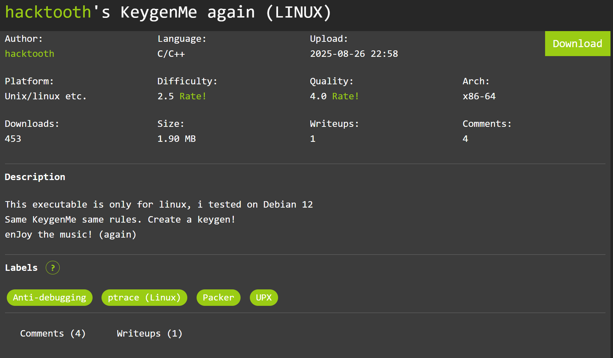
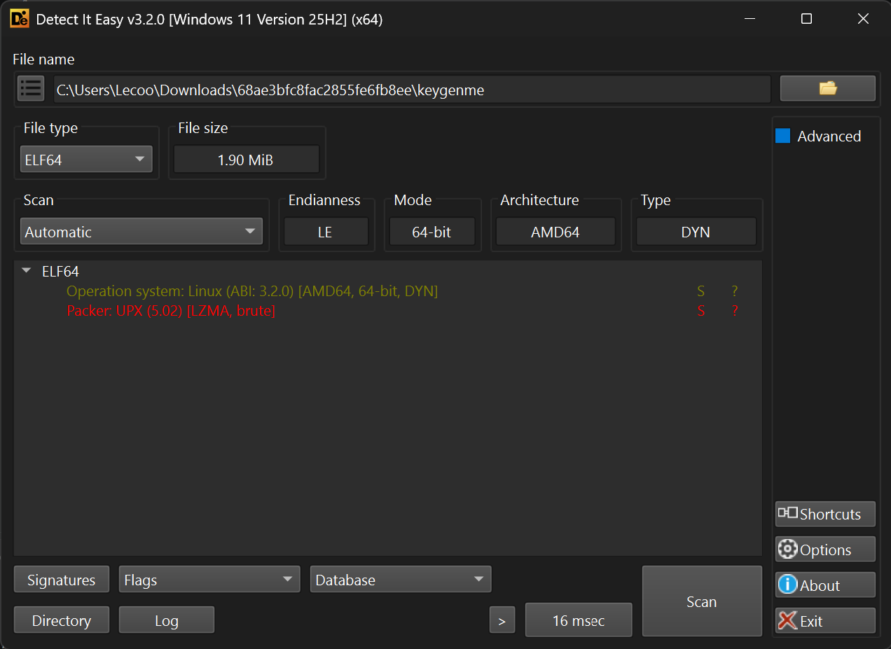
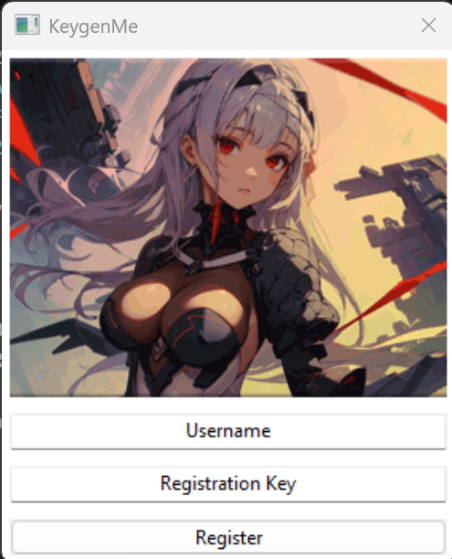
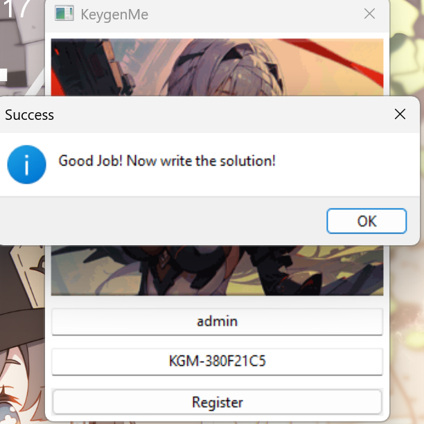

# KeygenMe 
## Summary



This executable is only for linux, i tested on Debian 12
Same KeygenMe same rules. Create a keygen!
enJoy the music! (again)


## Bước 1 — UPX unpacking



File gốc bị nén bằng UPX (version 5.02). Dùng UPX 5.2.0 để giải nén:

```bash
upx -d keygenme -o keygenme_unpacked
```
## Bước 2 — Nhận diện framework & tìm hàm check

- Nạp `keygenme_unpacked` vào IDA Pro.
- Dò chuỗi trong `.rodata` thấy các tên class C++ kiểu wxWidgets:
  - `KeygenMeForm`, `KeygenMe` → đây là app **wxWidgets GUI** (C++).
- Entry point `KeygenMe::OnInit` → window con của `KeygenMeForm`.
- Constructor `KeygenMeForm::KeygenMeForm` (`0x189c20`) tạo 2 ô text:

```c
*((_QWORD *)this + 133) = v75;   // TextCtrl 1 = Name
*((_QWORD *)this + 134) = v76;   // TextCtrl 2 = Key
```

- Các chuỗi hiển thị trong binary bị **XOR mã hoá** với key `0x18` (`xmmword_4F62D0`). Ví dụ:

```
bytes: 53 5F 55 35 18 ...
0x53^0x18='K'  0x5F^0x18='G'  0x55^0x18='M'  0x35^0x18='-'  0x18^0x18='\0'
→ "KGM-"
```

- Hàm xử lý Login là slot `KeygenMeForm::OnLogin` tại `0x188590`. Đây là nơi chứa toàn bộ logic.

---

## Bước 3 — Phân tích OnLogin (0x188590)

Giải mã C (trích các dòng quan trọng):

```c
// 1. Giải mã chuỗi text: "KGM-"
texts[4] ^= 0x18u;
*(unsigned int *)texts ^= 0x18181818;          // → "KGM-\x00"

// 2. Lấy Name (textctrl this+133) → std::string v122, dài v123
// 3. Lấy Key  (textctrl this+134) → std::string s1,  dài v126
```

### Thuật toán hash Name

```c
v24 = v123;                                // len(Name)
if (v123) {
    LOBYTE(v118) = *v122;                  // state[0] = name[0]
    if (v123 != 1) {
        v26 = 1;
        do {
            v27 = v26;
            v28 = v26++;
            *((_BYTE *)&v118 + (v28 & 3)) ^= v25[v27 % v24];
                                            // state[i & 3] ^= name[i]
        } while (v26 != v24);
    }
    v29 = v118 ^ 0xAC4C6B37;               // XOR dword với hằng số
} else {
    v29 = -1404277961;                     // 0xAC4C6B37 (empty name)
}
v118 = v29;
```

Tức là:

```
state = [name[0], 0, 0, 0]
for i in range(1, len(name)):
    state[i % 4] ^= name[i]        # XOR theo cột trên 4 byte
h = LE32(state) ^ 0xAC4C6B37
```

### Định dạng Key

```c
v30 = (unsigned __int8 *)&v118;             // 4 byte theo thứ tự bộ nhớ (LE)
do {
    sprintf(s, "%02X", *v30);               // mỗi byte → 2 hex hoa
    // nối s vào chuỗi src (8 ký tự)
    ++v30;
} while (v30 != (unsigned __int8 *)&v119);
```

Sau đó copy `"KGM-"` vào `s2` rồi append `src` (chuỗi hex 8 ký tự):

```
Key = "KGM-" + %02X%02X%02X%02X của 4 byte LE(h)
```

### Điều kiện

```c
if ( v126 != v136.m128i_i64[0]     // len(Key) phải == 12
  || v126 && memcmp(s1, s2, v126) // Key phải == "KGM-" + hex
  || msg_text[0] != 95 )           // hằng số anti-tamper, luôn đúng
    → FAIL
else
    → wxMessageBox(success)
```

- `v136.m128i_i64[0] = 8 + 4 = 12` → **Key dài đúng 12 ký tự**.
- `msg_text[0] != 95` là kiểm tra tính toàn vẹn của hằng số nén trong binary; với binary chưa sửa nó **luôn pass**, bỏ qua trong keygen.

---

## Bước 4 — Keygen

```python
XOR_KEY = 0xAC4C6B37

def key_for(name):
    data = name.encode("utf-8")
    state = [0, 0, 0, 0]
    state[0] = data[0]
    for i in range(1, len(data)):
        state[i & 3] ^= data[i]
    h = (state[0] | state[1]<<8 | state[2]<<16 | state[3]<<24) ^ XOR_KEY
    hexpart = "".join("%02X" % ((h >> (8*j)) & 0xFF) for j in range(4))
    return "KGM-" + hexpart
```

## Ví dụ



| Name | Key |
|------|-----|
| `Alice` | `KGM-130725CF` |
| `Bob` | `KGM-75042EAC` |
| `Rick` | `KGM-65022FC7` |
| `admin` | `KGM-380F21C5` |

Nhập Name vào ô 1, Key vào ô 2 → bấm Login → Success.



## Kết luận

- Bảo vệ chính là **XOR chuỗi** (`0x18`) để giấu các literal — dễ giải mã.
- Hash là **column XOR 4 byte** + XOR hằng `0xAC4C6B37` — không phải hàm băm an toàn, có thể **tổng hợp ngược** (keygen) tuyệt đối từ Name.
- Điểm yếu cốt lõi: validator là **công thức thuận nghịch**, không có khoá bí mật bất đối xứng nào → mọi Key hợp lệ sinh ra được hoàn toàn.
