# Flag pointer register
## Overview
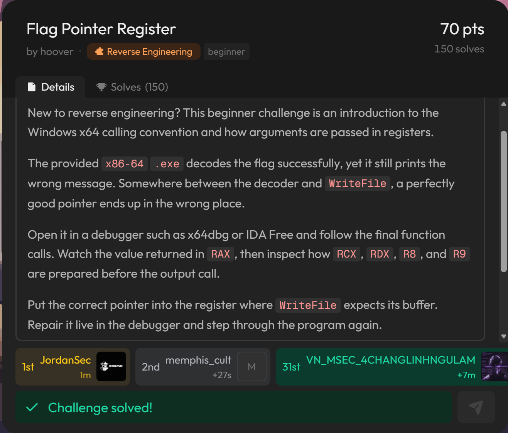
## Solution
As they said that we need to use some debugger like gdb or IDA

So i choose IDA to show how i solve this

When i disassemble the file, here is the pseudocode of the file 

**Start function:**
```C
void __noreturn start()
{
  HANDLE StdHandle; // rsi

  hFile = GetStdHandle(0xFFFFFFF5);
  StdHandle = GetStdHandle(0xFFFFFFF6);
  WriteFile(hFile, "Press ENTER to receive the flag.\r\n", 0x22u, &NumberOfBytesWritten, nullptr);
  ReadFile(StdHandle, &unk_14000304C, 8u, &NumberOfBytesWritten, nullptr);
  sub_140001000();
  WriteFile(hFile, "Access denied: RDX points to the wrong output buffer.", 0x39u, &NumberOfBytesWritten, nullptr);
  ExitProcess(0);
}
``` 

After that I try to run it.

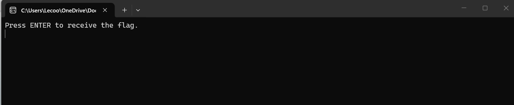

Press enter and nothing we can found from them

Now head to use debug in IDA i set a breakpoint like this

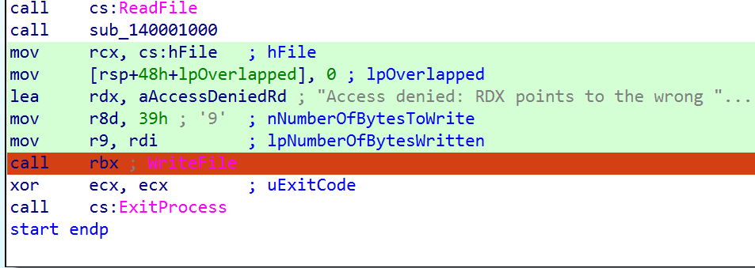

And start debugging, after that in the file .exe press ENTER once then you get the flag

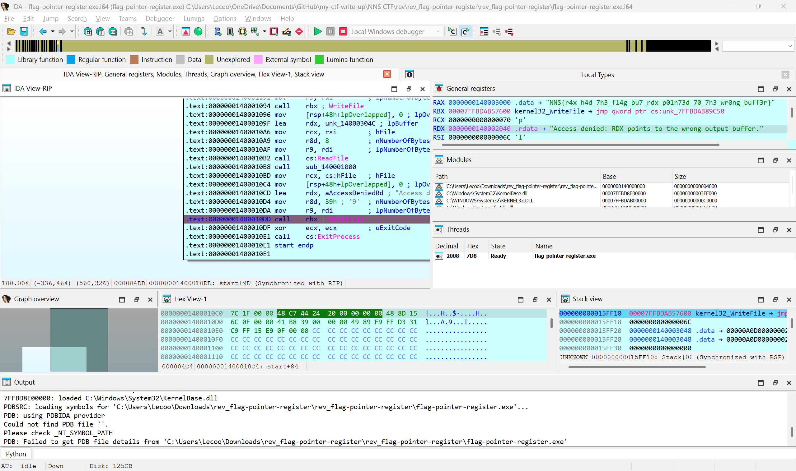

To explain why RDX point to wrong buffer you can visit this website

https://learn.microsoft.com/en-us/cpp/build/x64-calling-convention?view=msvc-170

This challenge want to explain the caller uses to make calls into another function but it call in this wrong place

## Flag
```
NNS{r4x_h4d_7h3_fl4g_bu7_rdx_p01n73d_70_7h3_wr0ng_buff3r}
```

# No Strings attached
## Summary
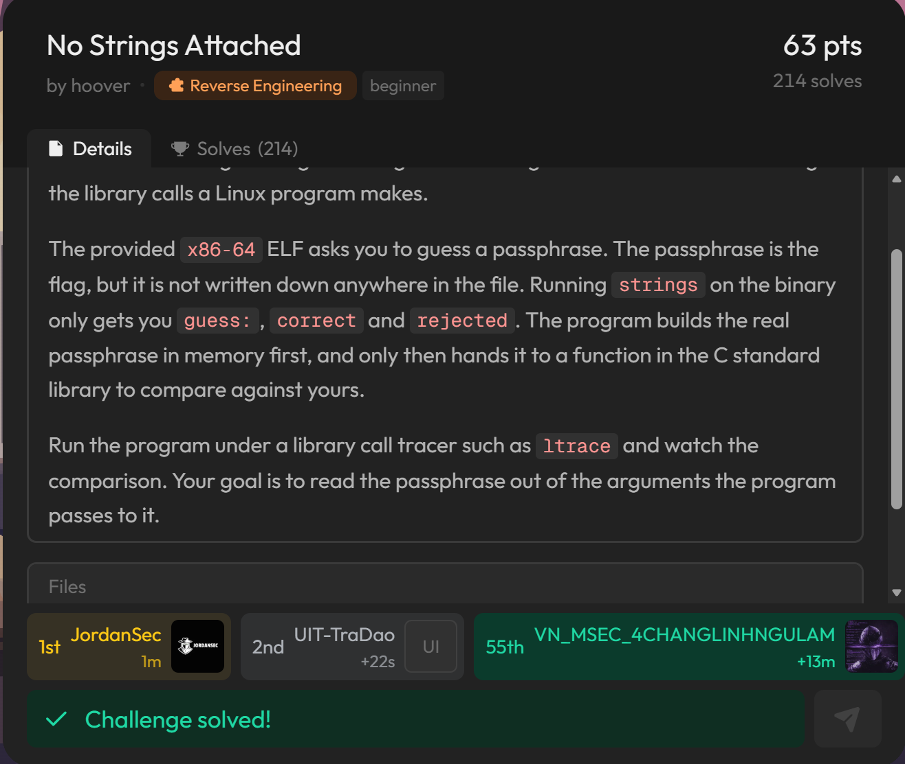

## Solution
Here is the pseudocode of the main function:
```c
int __fastcall main(int argc, const char **argv, const char **envp)
{
  int v4; // [rsp+0h] [rbp-10h]
  unsigned int i; // [rsp+4h] [rbp-Ch]
  ssize_t v6; // [rsp+8h] [rbp-8h]

  v4 = 6;
  write(1, "guess: ", 7u);
  v6 = read(0, input, 0x7Fu);
  if ( v6 <= 0 )
    return 1;
  if ( input[v6 - 1] == 10 )
    --v6;
  input[v6] = 0;
  for ( i = 0; i <= 0x37; ++i )
  {
    v4 = 1103515245 * v4 + 12345;
    secret[i] ^= BYTE2(v4);
  }
  if ( !strcmp(input, secret) )
  {
    write(1, "correct\n", 8u);
    return 0;
  }
  else
  {
    write(1, "rejected\n", 9u);
    return 2;
  }
}
```
Let move on the tool call `ltrace` to follow what hidden beside in the file

### Vulnerable
We have a vulnerable in this code 
```c
if ( !strcmp(input, secret) )
  {
    write(1, "correct\n", 8u);
    return 0;
  }
  else
  {
    write(1, "rejected\n", 9u);
    return 2;
  }
```
We need to catch the moment they call `strcmp()` because the real passphase already inside (In plaintext)

So `ltrace` can output dynamic library calls so they can read parameter 

You see the visual picture here:

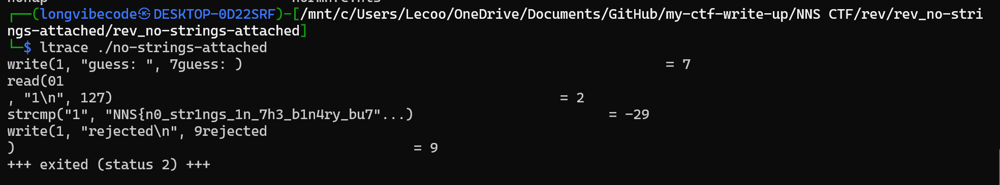

Because the `ltrace` has limit the size of output so to extend, combine the command `-s` with number char* you want

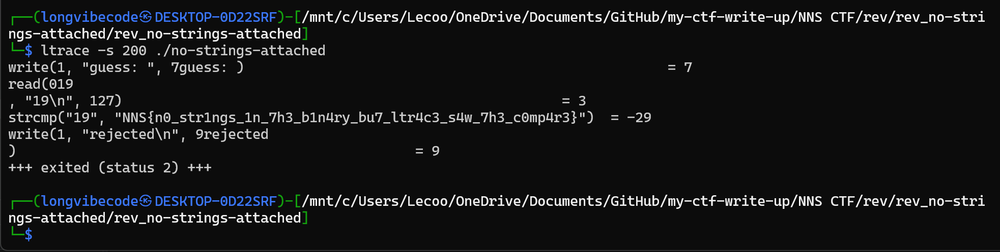

Want to know more about the `ltrace` you can visit this site: https://www.man7.org/linux/man-pages/man1/ltrace.1.html

For more infomation

## Flag
```
NNS{n0_str1ngs_1n_7h3_b1n4ry_bu7_ltr4c3_s4w_7h3_c0mp4r3}
```

# Open Secret
## Summary
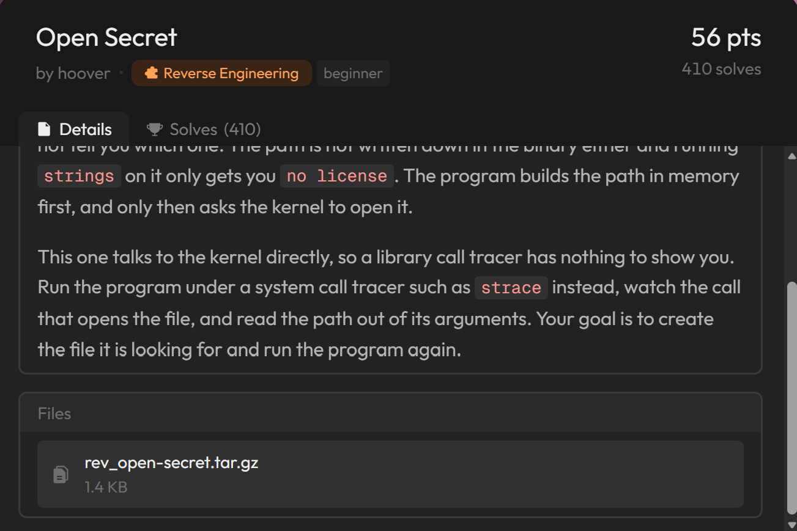

## Solution 
Let using `strace` (To get more info you can visit this site: https://www.man7.org/linux/man-pages/man1/strace.1.html )

First of all, the `strace` is the debugging tool that traces system calls and signals between processes and the kernel

Visual picture: 

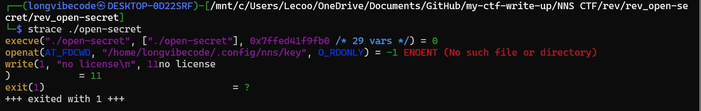

You can see this code
```
openat(AT_FDCWD, "/home/longvibecode/.config/nns/key", O_RDONLY) = -1 ENOENT (No such file or directory)
```

This code it mean that open a file or directory but it not have

To open it just make a new one with the `root` user by using `sudo` command

```linux
sudo mkdir -p /root/.config/nns
sudo bash -c 'echo "test" > /root/.config/nns/key'
sudo ./open-secret
```

If you can't execute the file just make sure you are in the folder have that file

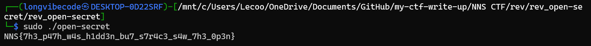

## Flag
```
NNS{7h3_p47h_w4s_h1dd3n_bu7_s7r4c3_s4w_7h3_0p3n}
```

# Scratch space
## Summary
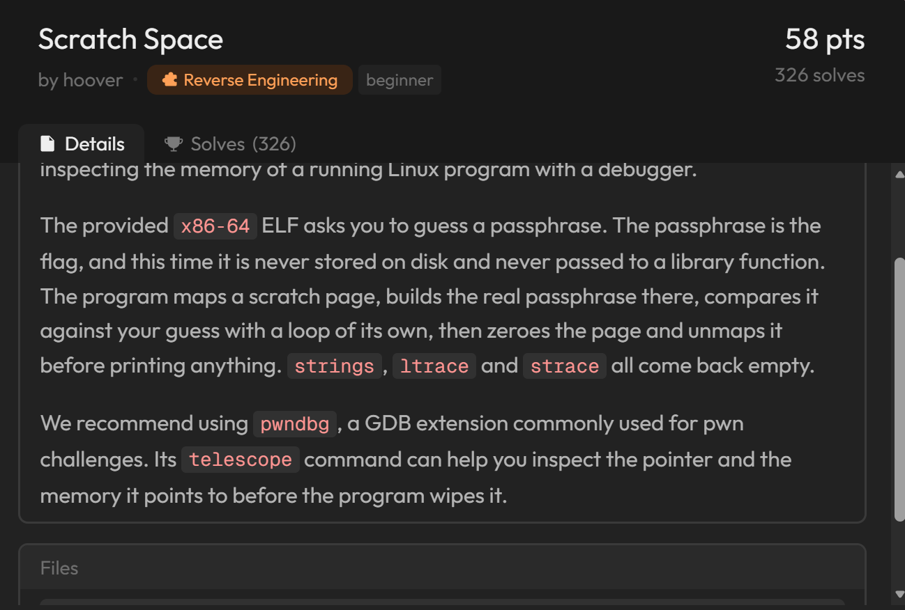

## Solution
Now we using the tool call `pwndbg` the extension of normal `gdb` to install it you can visit here:
https://github.com/pwndbg/pwndbg

Here is the code of main function:
```assembly
 0x0000000000401166 <+0>:     push   rbp
   0x0000000000401167 <+1>:     mov    rbp,rsp
   0x000000000040116a <+4>:     sub    rsp,0x20
   0x000000000040116e <+8>:     mov    DWORD PTR [rbp-0x1c],0x311023df
   0x0000000000401175 <+15>:    mov    DWORD PTR [rbp-0x14],0x1
   0x000000000040117c <+22>:    lea    rax,[rip+0xe85]        # 0x402008 <prompt>
   0x0000000000401183 <+29>:    mov    edx,0x7
   0x0000000000401188 <+34>:    mov    rsi,rax
   0x000000000040118b <+37>:    mov    edi,0x1
   0x0000000000401190 <+42>:    call   0x401030 <write@plt>
   0x0000000000401195 <+47>:    lea    rax,[rip+0x2f04]        # 0x4040a0 <input>
   0x000000000040119c <+54>:    mov    edx,0x7f
   0x00000000004011a1 <+59>:    mov    rsi,rax
   0x00000000004011a4 <+62>:    mov    edi,0x0
   0x00000000004011a9 <+67>:    call   0x401050 <read@plt>
   0x00000000004011ae <+72>:    mov    QWORD PTR [rbp-0x10],rax
   0x00000000004011b2 <+76>:    cmp    QWORD PTR [rbp-0x10],0x0
   0x00000000004011b7 <+81>:    jg     0x4011c3 <main+93>
   0x00000000004011b9 <+83>:    mov    eax,0x1
   0x00000000004011be <+88>:    jmp    0x40133d <main+471>
   0x00000000004011c3 <+93>:    mov    rax,QWORD PTR [rbp-0x10]
   0x00000000004011c7 <+97>:    lea    rdx,[rax-0x1]
   0x00000000004011cb <+101>:   lea    rax,[rip+0x2ece]        # 0x4040a0 <input>
   0x00000000004011d2 <+108>:   movzx  eax,BYTE PTR [rdx+rax*1]
   0x00000000004011d6 <+112>:   cmp    al,0xa
   0x00000000004011d8 <+114>:   jne    0x4011df <main+121>
   0x00000000004011da <+116>:   sub    QWORD PTR [rbp-0x10],0x1
   0x00000000004011df <+121>:   lea    rdx,[rip+0x2eba]        # 0x4040a0 <input>
   0x00000000004011e6 <+128>:   mov    rax,QWORD PTR [rbp-0x10]
   0x00000000004011ea <+132>:   add    rax,rdx
   0x00000000004011ed <+135>:   mov    BYTE PTR [rax],0x0
   0x00000000004011f0 <+138>:   mov    r9d,0x0
   0x00000000004011f6 <+144>:   mov    r8d,0xffffffff
   0x00000000004011fc <+150>:   mov    ecx,0x22
   0x0000000000401201 <+155>:   mov    edx,0x3
   0x0000000000401206 <+160>:   mov    esi,0x1000
   0x000000000040120b <+165>:   mov    edi,0x0
   0x0000000000401210 <+170>:   call   0x401040 <mmap@plt>
   0x0000000000401215 <+175>:   mov    QWORD PTR [rbp-0x8],rax
   0x0000000000401219 <+179>:   mov    DWORD PTR [rbp-0x18],0x0
   0x0000000000401220 <+186>:   jmp    0x40125d <main+247>
   0x0000000000401222 <+188>:   mov    eax,DWORD PTR [rbp-0x1c]
   0x0000000000401225 <+191>:   imul   eax,eax,0x343fd
   0x000000000040122b <+197>:   add    eax,0x269ec3
   0x0000000000401230 <+202>:   mov    DWORD PTR [rbp-0x1c],eax
   0x0000000000401233 <+205>:   mov    eax,DWORD PTR [rbp-0x18]
   0x0000000000401236 <+208>:   lea    rdx,[rip+0x2e03]        # 0x404040 <blob>
   0x000000000040123d <+215>:   movzx  ecx,BYTE PTR [rax+rdx*1]
   0x0000000000401241 <+219>:   mov    eax,DWORD PTR [rbp-0x1c]
   0x0000000000401244 <+222>:   shr    eax,0x10
   0x0000000000401247 <+225>:   mov    esi,eax
   0x0000000000401249 <+227>:   mov    edx,DWORD PTR [rbp-0x18]
   0x000000000040124c <+230>:   mov    rax,QWORD PTR [rbp-0x8]
   0x0000000000401250 <+234>:   add    rax,rdx
   0x0000000000401253 <+237>:   xor    ecx,esi
   0x0000000000401255 <+239>:   mov    edx,ecx
   0x0000000000401257 <+241>:   mov    BYTE PTR [rax],dl
   0x0000000000401259 <+243>:   add    DWORD PTR [rbp-0x18],0x1
   0x000000000040125d <+247>:   cmp    DWORD PTR [rbp-0x18],0x29
   0x0000000000401261 <+251>:   jbe    0x401222 <main+188>
   0x0000000000401263 <+253>:   mov    rax,QWORD PTR [rbp-0x8]
   0x0000000000401267 <+257>:   add    rax,0x2a
   0x000000000040126b <+261>:   mov    BYTE PTR [rax],0x0
   0x000000000040126e <+264>:   lea    rax,[rip+0xdbb]        # 0x402030 <checking>
   0x0000000000401275 <+271>:   mov    edx,0xc
   0x000000000040127a <+276>:   mov    rsi,rax
   0x000000000040127d <+279>:   mov    edi,0x1
   0x0000000000401282 <+284>:   call   0x401030 <write@plt>
   0x0000000000401287 <+289>:   mov    DWORD PTR [rbp-0x18],0x0
   0x000000000040128e <+296>:   jmp    0x4012ba <main+340>
   0x0000000000401290 <+298>:   mov    eax,DWORD PTR [rbp-0x18]
   0x0000000000401293 <+301>:   lea    rdx,[rip+0x2e06]        # 0x4040a0 <input>
   0x000000000040129a <+308>:   movzx  edx,BYTE PTR [rax+rdx*1]
   0x000000000040129e <+312>:   mov    ecx,DWORD PTR [rbp-0x18]
   0x00000000004012a1 <+315>:   mov    rax,QWORD PTR [rbp-0x8]
   0x00000000004012a5 <+319>:   add    rax,rcx
   0x00000000004012a8 <+322>:   movzx  eax,BYTE PTR [rax]
   0x00000000004012ab <+325>:   cmp    dl,al
   0x00000000004012ad <+327>:   je     0x4012b6 <main+336>
   0x00000000004012af <+329>:   mov    DWORD PTR [rbp-0x14],0x0
   0x00000000004012b6 <+336>:   add    DWORD PTR [rbp-0x18],0x1
   0x00000000004012ba <+340>:   cmp    DWORD PTR [rbp-0x18],0x29
   0x00000000004012be <+344>:   jbe    0x401290 <main+298>
   0x00000000004012c0 <+346>:   mov    DWORD PTR [rbp-0x18],0x0
   0x00000000004012c7 <+353>:   jmp    0x4012da <main+372>
   0x00000000004012c9 <+355>:   mov    edx,DWORD PTR [rbp-0x18]
   0x00000000004012cc <+358>:   mov    rax,QWORD PTR [rbp-0x8]
   0x00000000004012d0 <+362>:   add    rax,rdx
   0x00000000004012d3 <+365>:   mov    BYTE PTR [rax],0x0
   0x00000000004012d6 <+368>:   add    DWORD PTR [rbp-0x18],0x1
   0x00000000004012da <+372>:   cmp    DWORD PTR [rbp-0x18],0x2a
   0x00000000004012de <+376>:   jbe    0x4012c9 <main+355>
   0x00000000004012e0 <+378>:   mov    rax,QWORD PTR [rbp-0x8]
   0x00000000004012e4 <+382>:   mov    esi,0x1000
   0x00000000004012e9 <+387>:   mov    rdi,rax
   0x00000000004012ec <+390>:   call   0x401060 <munmap@plt>
   0x00000000004012f1 <+395>:   cmp    DWORD PTR [rbp-0x14],0x0
   0x00000000004012f5 <+399>:   je     0x401312 <main+428>
   0x00000000004012f7 <+401>:   lea    rax,[rip+0xd12]        # 0x402010 <accepted>
   0x00000000004012fe <+408>:   mov    edx,0x8
   0x0000000000401303 <+413>:   mov    rsi,rax
   0x0000000000401306 <+416>:   mov    edi,0x1
   0x000000000040130b <+421>:   call   0x401030 <write@plt>
   0x0000000000401310 <+426>:   jmp    0x40132b <main+453>
   0x0000000000401312 <+428>:   lea    rax,[rip+0xd07]        # 0x402020 <rejected>
   0x0000000000401319 <+435>:   mov    edx,0x9
   0x000000000040131e <+440>:   mov    rsi,rax
   0x0000000000401321 <+443>:   mov    edi,0x1
   0x0000000000401326 <+448>:   call   0x401030 <write@plt>
   0x000000000040132b <+453>:   cmp    DWORD PTR [rbp-0x14],0x0
   0x000000000040132f <+457>:   je     0x401338 <main+466>
   0x0000000000401331 <+459>:   mov    eax,0x0
   0x0000000000401336 <+464>:   jmp    0x40133d <main+471>
   0x0000000000401338 <+466>:   mov    eax,0x2
   0x000000000040133d <+471>:   leave
   0x000000000040133e <+472>:   ret
```
Now we gonna set the breakpoint in `*0x40126e`, after that run it and read the `$rbp-0x8` parameter to see what changed

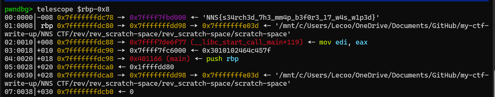

You can view `memory disclosure via process introspection` to see why it cant hide the password if the attacker have privilege the running process control 

## Flag
```
NNS{s34rch3d_7h3_mm4p_b3f0r3_17_w4s_w1p3d}
```

# Patch Tuesday
## Summary

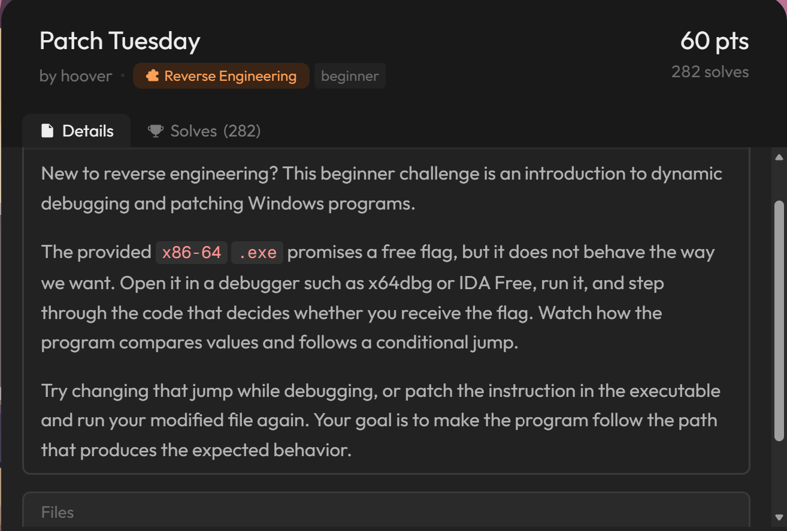

## Solution
Now we are using IDA to debug this file
the pseudocode C of the start function:

```c
void __noreturn start()
{
  HANDLE StdHandle; // rsi
  __int64 i; // rax
  DWORD NumberOfBytesWritten; // [rsp+30h] [rbp-18h] BYREF
  DWORD NumberOfBytesRead; // [rsp+34h] [rbp-14h] BYREF

  NumberOfBytesRead = 0;
  hFile = GetStdHandle(0xFFFFFFF5);
  StdHandle = GetStdHandle(0xFFFFFFF6);
  WriteFile(hFile, "Press ENTER to get a free NNS{ flag: ", 0x25u, &NumberOfBytesWritten, nullptr);
  ReadFile(StdHandle, &unk_140003060, 0x10u, &NumberOfBytesRead, nullptr);
  if ( !(unsigned int)sub_140001160(NumberOfBytesRead) )
  {
    WriteFile(hFile, "Sorry, no free flag for you.\r\n", 0x1Eu, &NumberOfBytesWritten, nullptr);
    ExitProcess(2u);
  }
  for ( i = 0; i != 76; ++i )
    byte_140003000[i] ^= 0x5Au;
  WriteFile(hFile, "Correct! Here is your free flag: ", 0x21u, &NumberOfBytesWritten, nullptr);
  WriteFile(hFile, byte_140003000, 0x4Cu, &NumberOfBytesWritten, nullptr);
  WriteFile(hFile, "\r\n", 2u, &NumberOfBytesWritten, nullptr);
  ExitProcess(0);
}
```
I cant copy all of the code the assembly because it so complicated to show you can view it in IDA 

Now i will show where to add breakpoint for this challenge
```
call    sub_140001160
xor     ecx, ecx        ; uExitCode
```

Maybe this will have more detail

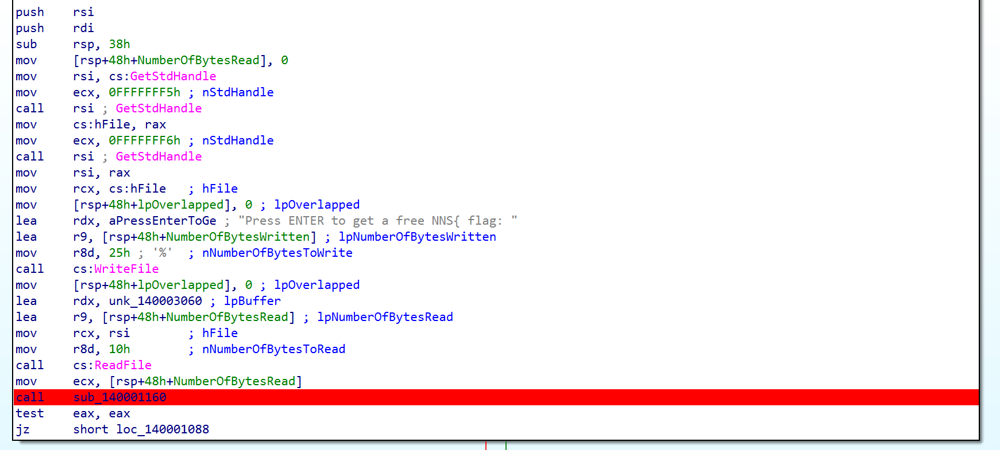

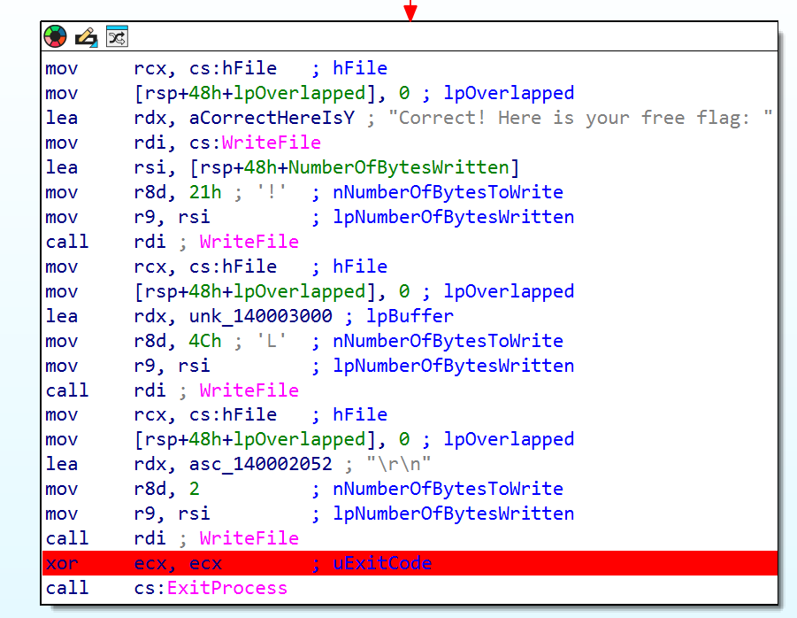

Let start debugging while debugging click `ENTER` the .exe to continue

If you dont change the value of `ZF` it wont let us to get what we want so here to change

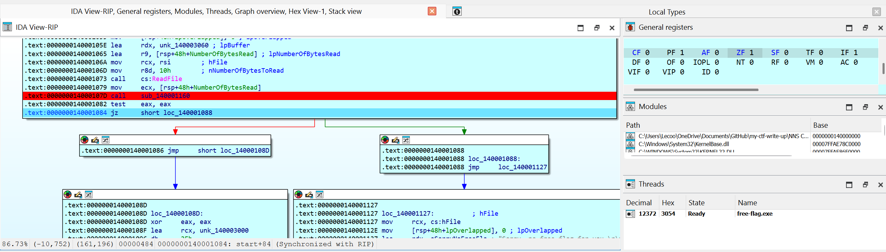

You can see it will jump as the `ZF` value is 1 now we change it to zero 

After that press `F9` to get the flag

Btw this flag it encoded with the xor algorithm

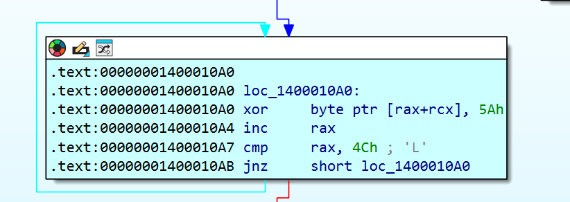

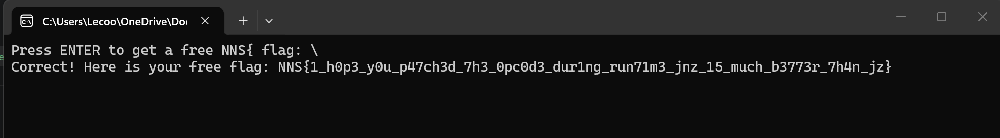

This challenge is a normal anti-debugging to make it why only debug wont make the result

## Flag
```
NNS{1_h0p3_y0u_p47ch3d_7h3_0pc0d3_dur1ng_run71m3_jnz_15_much_b3773r_7h4n_jz}
```


